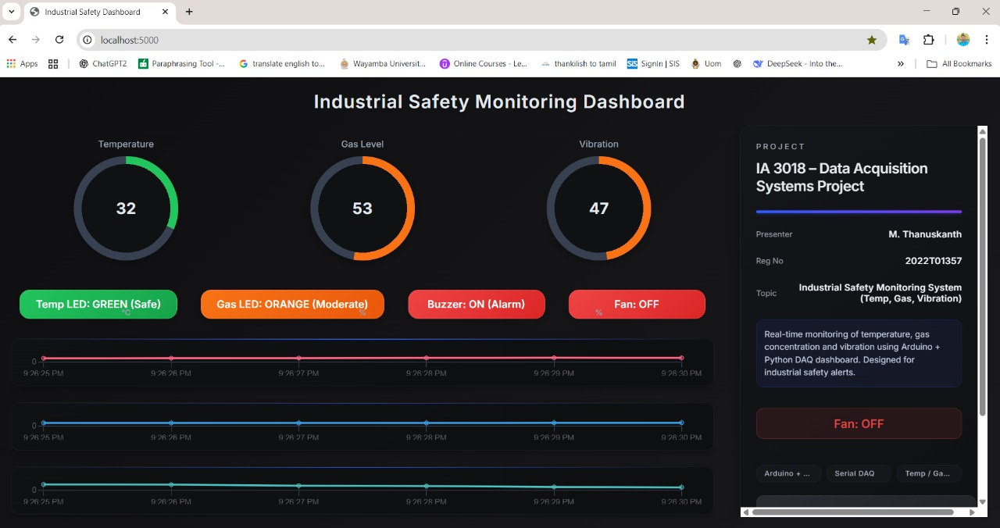
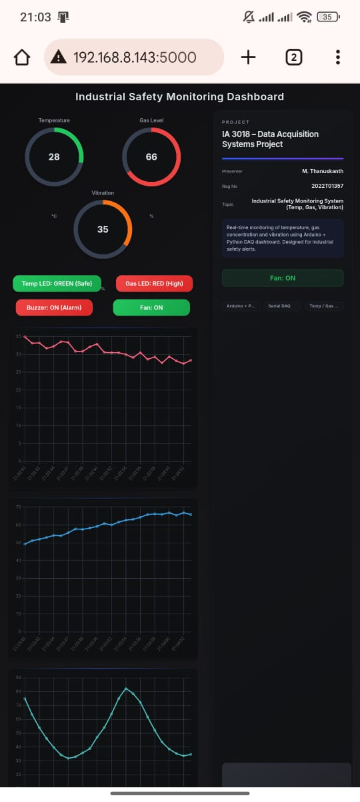
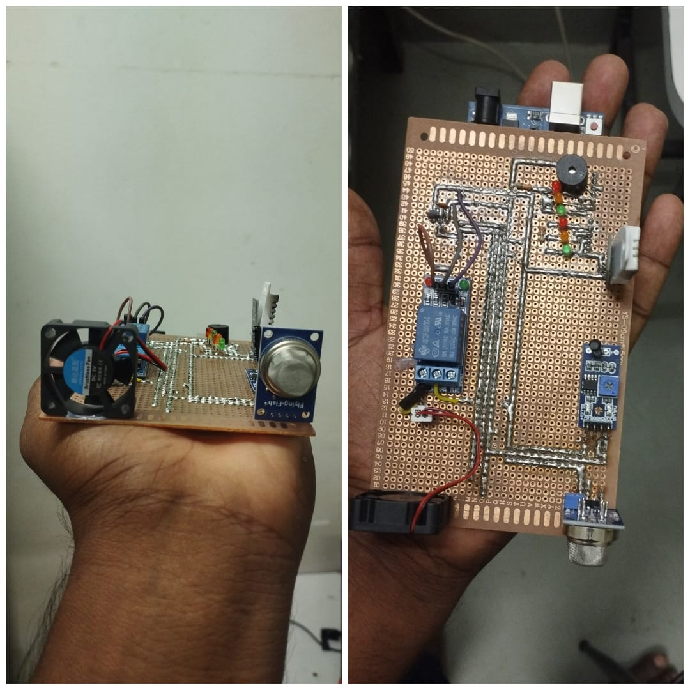
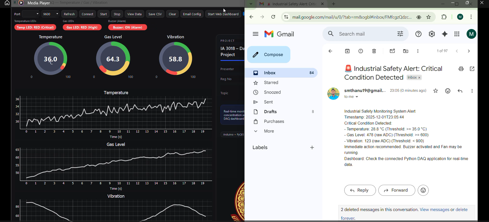

<!-- Banner / 4 Photo Collage -->
<p align="center">
  
  
  
  
  
</p>

<h1 align="center">🛡️ Industrial Safety Monitoring System</h1>

<p align="center">
  Real-time monitoring for temperature, gas leaks & vibrations with email alerts, web dashboard and automatic safety actions.
</p>

---

## 🔍 Project Overview

This project is an **Industrial Safety Monitoring System** designed to keep a work area in a safe operating zone.  

Using:

- 🌡️ **DHT22** – temperature & humidity detection  
- 🧪 **MQ135** – gas / air quality detection  
- 📳 **Vibration Sensor** – abnormal vibration / impact detection  
- 🔔 **Buzzer** – audible alarm for critical conditions  
- 💨 **DC Fan** – emergency ventilation / cooling  
- ⚡ **Relay Module** – automatic control of fan or other safety devices  

The system continuously measures the environment and:

- Shows live data on a **web dashboard** (also viewable from mobile 📱)
- Sends **email alerts** when critical thresholds are exceeded
- Activates **buzzer + relay + fan** in dangerous situations
- Tries to bring the area back to a **safe mode** after detection

---

## ✨ Key Features

- ✅ **Real-time monitoring**
  - Temperature & humidity (DHT22)  
  - Gas/air quality levels (MQ135)  
  - Vibrations / shocks (vibration sensor)
 
    

- 📊 **Web Dashboard**
  - Live sensor readings
  - Status indicators (Safe / Warning / Critical)
  - Mobile-friendly interface
  
  

- 📧 **Email Alerts**
  - Automatic email when:
    - Temperature too high
    - Gas level above safe limit
    - Abnormal vibration detected
    

- 🚨 **Automatic Safety Actions**
  - Buzzer ON for immediate alert  
  - Relay ON → DC fan starts for cooling/ventilation  
  - System keeps running until readings return to **safe zone**

- 🧱 **Modular Design**
  - Easy to add more sensors (flame, smoke, etc.)
  - Can be extended to multiple zones in a factory

---

## 🧠 System Concept

**Normal Mode (Safe Zone)**  
- All values are within limits → Dashboard shows ✅ SAFE  
- Buzzer OFF, relay OFF, fan OFF (or in low/standby mode)

**Critical Mode (Danger Zone)**  
Triggered when any of the following exceeds threshold:

- High temperature (e.g. overheating machinery)
- High gas level (possible leak or poor air quality)
- Strong or continuous vibration (mechanical fault)

Then the system will:

1. Turn **Buzzer ON** – warning to nearby workers  
2. Turn **Relay ON** – start **DC fan** or other safety device  
3. Send **Email Alert** to configured address  
4. Show **CRITICAL** status on the web dashboard  

Once conditions return to safe range, the system goes back to **Safe Mode** automatically.

---

## 🧩 Hardware Components

| Component        | Purpose                               |
|-----------------|----------------------------------------|
| DHT22           | Temperature & humidity sensing         |
| MQ135           | Gas / air quality detection            |
| Vibration Sensor| Vibration / impact detection           |
| Buzzer          | Audible alert in critical conditions   |
| DC Fan          | Cooling / ventilation                  |
| Relay Module    | Controls fan / other safety devices    |
| IoT Controller  | ESP32 / ESP8266 / Arduino + Wi-Fi      |
| Power Supply    | Stable 5V/12V for sensors + fan        |

> 🔧 You can adapt the controller board (ESP32, ESP8266, etc.) depending on your actual implementation.

---

## 🛠️ Software / Tech Stack

- Firmware (C/C++ / Arduino IDE / PlatformIO)
- Web dashboard (HTML / CSS / JS or IoT dashboard platform)
- Email alert service (SMTP or third-party service)
- Optional: REST API / WebSocket for live updates

---

## ⚙️ How It Works (Logic Flow)

1. **Read Sensors**
   - DHT22 → temperature & humidity
   - MQ135 → gas concentration / air quality index
   - Vibration sensor → digital/analog vibration signal

2. **Process Data**
   - Compare readings with predefined **safe thresholds**
   - Classify state as:
     - ✅ SAFE  
     - ⚠️ WARNING  
     - 🔴 CRITICAL  

3. **Trigger Actions**
   - If CRITICAL:
     - Buzzer = ON  
     - Relay = ON → DC fan ON  
     - Send email alert
   - If back to SAFE:
     - Buzzer = OFF  
     - Relay/Fan = OFF (or normal mode)

4. **Update Dashboard**
   - Send data to web dashboard at regular intervals
   - Show live graphs & status indicators

---

## 🚀 Getting Started

> 📝 Adjust these steps according to your actual code and board.

### 1️⃣ Clone the Repository

```bash
git clone https://github.com/Thanuskanth19/Industrial-Safety-Monitoring.git
cd Industrial-Safety-Monitoring
